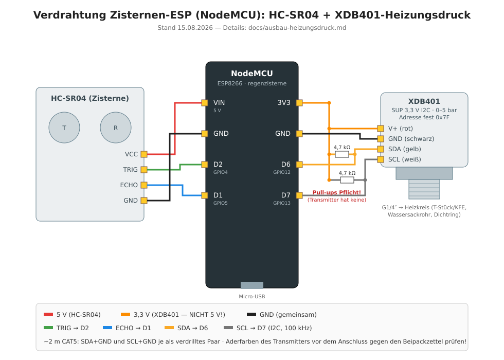

# Ausbau (geplant): Heizungsdruck am Zisternen-ESP mitmessen

Erweiterung des bestehenden Zisternen-Knotens (`regenzisterne`) um einen **Drucksensor für den
Heizungs-Wasserkreislauf**. Weil Heizung und Zisternen-ESP **im selben Raum** stehen (Kabelweg
**max. 2 m**), wird der Sensor **mit an den vorhandenen NodeMCU** gehängt — kein zweiter Knoten
nötig. Status: **geplant, noch nicht umgesetzt.**

## Entscheidung in einem Satz
Digitaler **I2C-Drucksensor XIDIBEI XDB401** (G1/4", 0–5 bar relativ) an die **freien** Pins
D6/D7 des Zisternen-ESP, per nativem ESPHome-Treiber `xdb401` ausgelesen, in bar kalibriert gegen
das Kessel-Manometer.

## Warum genau dieser Sensor
- **I2C statt Analog:** umgeht den einzigen, verrauschten 10-bit-A0 des ESP8266 **und** das
  5-V-Problem (ESP8266 ist nicht 5-V-tolerant) komplett. Kein ADS1115, kein Spannungsteiler.
- **Nativer ESPHome-Support** (`platform: xdb401`) — liefert **Druck und Temperatur**.
- **G1/4"-Gewinde**, echter Flüssigkeitsanschluss, Edelstahl/Keramikzelle.
- **Bereich:** 0–5 bar relativ (Überdruck) ist der Sweetspot: Systemdruck 1–2 bar, Sicherheitsventil
  3 bar → genug Reserve, gute Auflösung. **Wichtig: „relativ"/Überdruck, nicht „absolut".**

> **Kauf-Variante (wichtig):** Diese Sammelanzeigen (z. B. „SUP 3.3V OUT I2C … G1/4 5–12 V 0–5 V …")
> bündeln mehrere Ausführungen. Wähle die **I2C-Version mit 3,3-V-Versorgung** und den
> **5-bar-Bereich (0,5 MPa), relativ/Überdruck** — die ebenfalls angebotenen **0–5-V-Analog-** und
> **5–12-V-Varianten passen hier nicht**. Solche Keramik-/Edelstahl-G1/4-I2C-Sensoren sind
> XDB401-kompatibel (nativer ESPHome-`xdb401`-Treiber); I2C-Adresse **fest 0x7F** (nur ein Sensor pro
> Bus), Druck wird in **Pascal** geliefert (in der Konfig × 0,00001 → bar).

## Anschluss am ESP (Verdrahtung)
Der Ultraschall nutzt **GPIO4 (D2) = TRIG** und **GPIO5 (D1) = ECHO** — das sind **Digital**-Pins.
I2C ist am ESP8266 in Software nachgebildet und darf **beliebige freie** Pins nutzen; nur **nicht**
D1/D2. Gewählt: **SDA = D6 (GPIO12), SCL = D7 (GPIO13)** (frei, keine Boot-Strapping-Pins).

| XDB401 | NodeMCU | Bemerkung |
|---|---|---|
| V+ | **3V3** | am 3,3-V-Pin betreiben (nicht 5 V nötig) |
| GND | **GND** | gemeinsame Masse |
| SDA | **D6 (GPIO12)** | **nicht** D1/D2 (Ultraschall!) |
| SCL | **D7 (GPIO13)** | " |

Der Ultraschall-Block bleibt **unverändert**; der XDB401 kommt nur zusätzlich dazu.

## I2C über 2 m — damit es stabil bleibt
2 m sind die obere Grenze für I2C, mit diesen Vorkehrungen unkritisch:
- **Kabel:** verdrillt/geschirmt — ideal ein Stück **CAT5/Netzwerkkabel**: ein Paar SDA+GND, ein
  Paar SCL+GND. GND immer mitführen.
- **Takt niedrig:** **100 kHz** (`frequency: 100kHz`), bei Bedarf 50 kHz. Kein 400 kHz.
- **Pull-ups:** auf 2 m etwas kräftiger (~**3,3–4,7 kΩ** nach 3V3). Hat die XDB401-Platine nur
  schwache 10 kΩ, je einen ~3,3-kΩ-Widerstand SDA→3V3 und SCL→3V3 **am ESP-Ende** ergänzen.
- **Verlegung:** nicht eng an der **Heizungspumpe**/Netzleitungen führen (Störeinstreuung).
- Falls es wider Erwarten zickt (fehlende Werte/NACKs): erst **50 kHz**, dann stärkere Pull-ups,
  zur Not I2C-Bus-Extender (bei 2 m praktisch nie nötig).

## ESPHome-Konfiguration (Ansatz)
Kommt **zusätzlich** in die bestehende `regenzisterne.yaml`. Der Ultraschall-Teil bleibt, wie er ist.

> **Hinweis:** Schema gegen die [ESPHome-`xdb401`-Doku](https://esphome.io/components/sensor/xdb401/)
> verifiziert (Stand 08/2026). I2C-Adresse fest **0x7F**; `pressure_range_bar` **muss zum gekauften
> Sensor passen** (hier **5**). Der Sensor liefert **Pascal** → `multiply: 0.00001` ergibt bar. Die
> `calibrate_linear`-Stützpunkte sind **Platzhalter** und werden real gegen das Manometer gemessen.

```yaml
i2c:
  sda: GPIO12          # D6 — frei; NICHT D1/D2 (dort haengt der Ultraschall)
  scl: GPIO13          # D7
  frequency: 100kHz    # auf 2 m Kabel bewusst langsam
  scan: true           # beim ersten Start die erkannte Adresse im Log kontrollieren

sensor:
  - platform: xdb401
    address: 0x7F              # fest (nicht aenderbar) — nur EIN XDB401 pro Bus
    pressure_range_bar: 5      # MUSS zum gekauften Sensor passen -> 5-bar-Variante!
    pressure:
      name: "Heizungsdruck"
      id: heizungsdruck
      unit_of_measurement: bar
      device_class: pressure
      state_class: measurement
      accuracy_decimals: 2
      filters:
        - multiply: 0.00001          # Sensor liefert PASCAL -> bar
        # Feinabgleich gegen das Kessel-Manometer (zwei real gemessene Werte):
        - calibrate_linear:
            method: least_squares
            datapoints:
              - 0.0 -> 0.0     # Anlage drucklos -> 0 bar
              - 1.8 -> 1.8     # bei Betriebsdruck: Rohwert -> Manometer-bar
        - sliding_window_moving_average:
            window_size: 6
            send_every: 1
    temperature:
      name: "Heizung Sensortemperatur"
      unit_of_measurement: "°C"
      device_class: temperature
      state_class: measurement
      accuracy_decimals: 1
    update_interval: 30s
```

Einspielen per **OTA** (Dashboard → `regenzisterne` → Install → „Wirelessly").

## Home Assistant
- Neue Entitäten erscheinen per MQTT-Discovery **unter dem bestehenden Gerät „Regenzisterne"**:
  `sensor.regenzisterne_heizungsdruck` und `sensor.regenzisterne_heizung_sensortemperatur`.
  (Rein kosmetisch, dass der Heizungsdruck unter „Regenzisterne" hängt — funktioniert einwandfrei,
  lässt sich in HA beschriften. Nur wer strikte Trennung will, nähme einen eigenen Knoten.)
- **Sinnvolle Automatisierung:** Meldung, wenn `Heizungsdruck < 1,0 bar` (Nachfüllen fällig) oder
  `> 2,5 bar` (Richtung Sicherheitsventil) — analog zu den anderen HA-Benachrichtigungen.

## Mechanischer Einbau & Sicherheit
- **Abgriff:** am **KFE-Hahn** (Kessel-Füll-/Entleerhahn) oder per **T-Stück am Manometer** —
  vorhandenen Mess-/Füllpunkt nutzen, nicht neu in die Leitung schneiden.
- **Adapter:** Sensor ist G1/4" außen; per Reduziernippel/T-Stück an den vorhandenen Anschluss.
- **Thermischer Schutz:** Vorlauf bis ~90 °C, günstige Sensoren nur ~85 °C → ein
  **Wassersackrohr/Siphon** (kurzes gebogenes Standrohr) davor schützt die Membran ohne
  Genauigkeitsverlust (Wasser ist inkompressibel). Alternativ kühlere Stelle (Rücklauf/KFE) oder
  ein 150-°C-Sensor.
- **Abdichten:** G1/4" ist **zylindrisch** → dichtet an der **Planfläche** (Flach-/Profildichtring,
  O-Ring), **kein** Hanf/PTFE auf dem Gewinde.
- **Sicherheit:** reines Lesen, Kleinspannung, keine Netzspannung → ungefährlich. **Anlage vor dem
  Einbau drucklos machen und abkühlen** lassen; **Sicherheitsventil unangetastet** lassen (nie in
  dessen Leitung einbauen/absperren). Bei Unsicherheit den Stutzen vom Heizungsbauer setzen lassen.

## Teileliste (ca.)
| Teil | ca. |
|---|---|
| XIDIBEI XDB401 (I2C, G1/4, 0–5 bar relativ) | 12–20 € |
| CAT5-Kabelstück (2 m) | wenige € |
| ggf. 2× Pull-up 3,3 kΩ | <1 € |
| Wassersackrohr/Manometer-Siphon | 8–20 € |
| T-Stück / Reduziernippel G1/4 + Dichtring | wenige € |
| **Summe** | **~25–45 €** |

## Umsetzungsschritte (Reihenfolge)
1. XDB401 (I2C-Variante, 0–5 bar relativ) besorgen; Temperatur-Spezifikation prüfen (sonst Siphon einplanen).
2. Am ESP verdrahten (3V3, GND, SDA=D6, SCL=D7), CAT5, ggf. Pull-ups.
3. `i2c:`-Block mit `scan: true` ergänzen, per OTA aufspielen, im **Log die I2C-Adresse** kontrollieren.
4. `xdb401`-Sensor ergänzen (Schema/Adresse gegen ESPHome-Doku), OTA.
5. **Kalibrieren:** zwei Punkte gegen das Manometer eintragen (drucklos = 0 bar, Betriebsdruck = X bar), OTA.
6. Sensor **physisch** an der Heizung einbauen (drucklos/kalt, Siphon, KFE/T-Stück, dichten), befüllen, entlüften, Dichtheit prüfen.
7. HA: Entitäten beschriften, optional Alarm < 1,0 bar / > 2,5 bar.

## Offene Punkte / vor dem Kauf prüfen
- **Kauf-Variante:** die **I2C-/3,3-V-Ausführung** mit **5-bar-Bereich** nehmen (nicht die 0–5-V-/5–12-V-Analogvarianten). *(xdb401-Schema, Adresse 0x7F, Pa-Ausgabe sind verifiziert.)*
- **Medien-Temperatur** der konkreten Variante prüfen (Keramikzelle verträgt viel, die Billig-Elektronik oft nur ~85 °C) → Wassersackrohr einplanen.
- Ob der Heizungsdruck bewusst unter dem Gerät „Regenzisterne" bleiben soll oder ein eigener Knoten gewünscht ist.


---

# UMSETZUNG 15.08.2026 — Anschlussplan & Inbetriebnahme (Sensor ist da)

Gekaufte Variante: **„SUP 3.3V OUT I2C", 0–0,5 MPa (= 0–5 bar), China** — XDB401-kompatibel,
G1/4"-Gewinde, Keramikzelle/Edelstahl. Firmware-Seite ist seit 15.08. eingespielt
(`i2c:` auf D6/D7 + `platform: xdb401` in `regenzisterne.yaml`), HA-Seite steht
(2 wählbare Warnstufen + Telegram, siehe unten).

## Anschlussplan (ESP = NodeMCU des Zisternen-Knotens)



*Grafisches Anschlussbild (SVG) — links der vorhandene Ultraschall, rechts der neue Drucktransmitter samt Pflicht-Pull-ups. Textfassung darunter.*

```
   XDB401 (SUP 3,3 V I2C)                    NodeMCU (regenzisterne)
   ──────────────────────                    ───────────────────────
   V+  (meist ROT)     ────────────────────  3V3
   GND (meist SCHWARZ) ────────────────────  GND
   SDA (meist GELB/GRÜN) ──────┬───────────  D6  (GPIO12)
                               └─[4,7 kΩ]──  3V3
   SCL (meist WEISS/BLAU) ─────┬───────────  D7  (GPIO13)
                               └─[4,7 kΩ]──  3V3
```

| Sensorader | NodeMCU-Pin | Hinweis |
|---|---|---|
| V+ | **3V3** | 3,3-V-Variante — NICHT an 5 V/VIN! |
| GND | **GND** | gemeinsame Masse |
| SDA | **D6 (GPIO12)** | nicht D1/D2 — die gehören dem Ultraschall |
| SCL | **D7 (GPIO13)** | " |

- **Aderfarben prüfen!** Bei den China-Transmittern variiert die Belegung (rot/schwarz/gelb/weiß
  ist üblich, aber nicht garantiert) — gegen den Beipackzettel/die Artikelseite verifizieren,
  bevor Spannung draufkommt. V+ auf SDA vertauscht übersteht der Sensor meist, 5 V auf V+ nicht.
- **Pull-ups sind Pflicht:** Der nackte Transmitter bringt keine mit. Je **4,7 kΩ** von SDA→3V3
  und SCL→3V3, **am ESP-Ende** verlöten.
- **Leitung (~2 m): CAT5**, ein verdrilltes Paar für SDA+GND, eines für SCL+GND, Rest ungenutzt
  (oder V+/GND doppelt). Nicht parallel zur Heizungspumpe/Netzleitungen legen.
- **Mechanik/Sicherheit** (unverändert von oben): Abgriff am KFE-Hahn/T-Stück, **Wassersackrohr**
  gegen die Vorlaufhitze, G1/4 dichtet an der **Planfläche** (Dichtring, kein Hanf aufs Gewinde),
  Anlage **drucklos + kalt** machen, Sicherheitsventil unangetastet.

## Inbetriebnahme (Reihenfolge)

1. ESP **stromlos** machen, Sensor nach Plan anschließen (Pull-ups nicht vergessen).
2. ESP einschalten → im ESPHome-Log (`Dashboard → regenzisterne → Logs`) muss der I2C-Scan
   **0x7F** melden; danach liefert `sensor.regenzisterne_heizungsdruck` alle 30 s Werte
   (offen/drucklos ≈ 0,0 bar).
3. Sensor an der Heizung einbauen (drucklos/kalt), befüllen, entlüften, Dichtheit prüfen.
4. **Plausibilität gegen das Kessel-Manometer:** Weicht die Anzeige ab, Zweipunkt-Feinabgleich
   per `calibrate_linear` hinter dem `multiply` (drucklos → 0, Betriebsdruck → Manometerwert).

## Warnstufen in Home Assistant (seit 15.08. aktiv)

| Baustein | Zweck |
|---|---|
| `input_number.heizungsdruck_warnstufe_1` (Start 1,2 bar) | **Stufe 1**, frei wählbar: darunter → Meldung nur in HA |
| `input_number.heizungsdruck_warnstufe_2` (Start 0,8 bar) | **Stufe 2**, frei wählbar: darunter → zusätzlich **Telegram** |
| Automation „Heizungsdruck niedrig (Stufe 1)" | persistente HA-Meldung, `for: 2 min` gegen Zappler |
| Automation „Heizungsdruck kritisch (Stufe 2)" | HA-Meldung + `telegram_bot.send_message` |
| Automation „Heizungsdruck wieder gut" | räumt beide Meldungen ab, wenn 5 min über Stufe 1 |

Solange der Sensor nicht angeschlossen ist, stehen die Entitäten auf `unavailable` — die
Automationen lösen dann bewusst **nicht** aus (numeric_state ignoriert Nicht-Zahlen).
